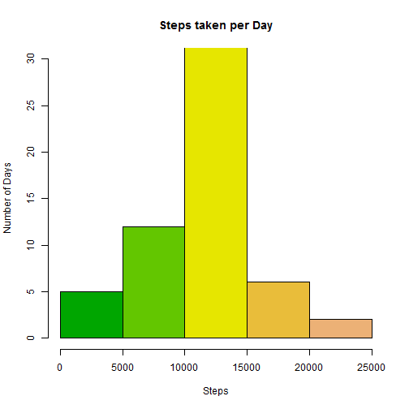
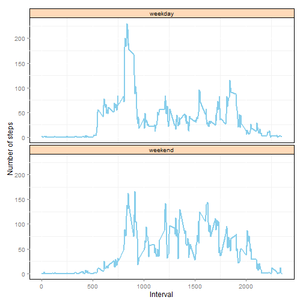

Read raw data

```r
RawData <- read.csv("activity.csv")
library("data.table")
DT <- data.table(RawData)
```
Total Steps Taken per day

```r
DTS<-DT[, sum(steps, na.rm=TRUE), by = list(date)]
setnames(DTS,"V1","Total Steps")
DTS
```

```
##           date Total Steps
##  1: 2012-10-01           0
##  2: 2012-10-02         126
##  3: 2012-10-03       11352
##  4: 2012-10-04       12116
##  5: 2012-10-05       13294
##  6: 2012-10-06       15420
##  7: 2012-10-07       11015
##  8: 2012-10-08           0
##  9: 2012-10-09       12811
## 10: 2012-10-10        9900
## 11: 2012-10-11       10304
## 12: 2012-10-12       17382
## 13: 2012-10-13       12426
## 14: 2012-10-14       15098
## 15: 2012-10-15       10139
## 16: 2012-10-16       15084
## 17: 2012-10-17       13452
## 18: 2012-10-18       10056
## 19: 2012-10-19       11829
## 20: 2012-10-20       10395
## 21: 2012-10-21        8821
## 22: 2012-10-22       13460
## 23: 2012-10-23        8918
## 24: 2012-10-24        8355
## 25: 2012-10-25        2492
## 26: 2012-10-26        6778
## 27: 2012-10-27       10119
## 28: 2012-10-28       11458
## 29: 2012-10-29        5018
## 30: 2012-10-30        9819
## 31: 2012-10-31       15414
## 32: 2012-11-01           0
## 33: 2012-11-02       10600
## 34: 2012-11-03       10571
## 35: 2012-11-04           0
## 36: 2012-11-05       10439
## 37: 2012-11-06        8334
## 38: 2012-11-07       12883
## 39: 2012-11-08        3219
## 40: 2012-11-09           0
## 41: 2012-11-10           0
## 42: 2012-11-11       12608
## 43: 2012-11-12       10765
## 44: 2012-11-13        7336
## 45: 2012-11-14           0
## 46: 2012-11-15          41
## 47: 2012-11-16        5441
## 48: 2012-11-17       14339
## 49: 2012-11-18       15110
## 50: 2012-11-19        8841
## 51: 2012-11-20        4472
## 52: 2012-11-21       12787
## 53: 2012-11-22       20427
## 54: 2012-11-23       21194
## 55: 2012-11-24       14478
## 56: 2012-11-25       11834
## 57: 2012-11-26       11162
## 58: 2012-11-27       13646
## 59: 2012-11-28       10183
## 60: 2012-11-29        7047
## 61: 2012-11-30           0
##           date Total Steps
```
Histogram of steps taken per day

```r
hist(DTS$'Total Steps', main="Steps taken per Day", ylab = "Number of Days", xlab="Steps",ylim=c(0,30),col=terrain.colors(7))
```

 

Mean and Median Steps taken per day

```r
DT[, list(Mean=mean(steps, na.rm=TRUE),Median=as.double(median(as.double(steps), na.rm=TRUE))), by = list(date)]
```

```
##           date       Mean Median
##  1: 2012-10-01        NaN     NA
##  2: 2012-10-02  0.4375000      0
##  3: 2012-10-03 39.4166667      0
##  4: 2012-10-04 42.0694444      0
##  5: 2012-10-05 46.1597222      0
##  6: 2012-10-06 53.5416667      0
##  7: 2012-10-07 38.2465278      0
##  8: 2012-10-08        NaN     NA
##  9: 2012-10-09 44.4826389      0
## 10: 2012-10-10 34.3750000      0
## 11: 2012-10-11 35.7777778      0
## 12: 2012-10-12 60.3541667      0
## 13: 2012-10-13 43.1458333      0
## 14: 2012-10-14 52.4236111      0
## 15: 2012-10-15 35.2048611      0
## 16: 2012-10-16 52.3750000      0
## 17: 2012-10-17 46.7083333      0
## 18: 2012-10-18 34.9166667      0
## 19: 2012-10-19 41.0729167      0
## 20: 2012-10-20 36.0937500      0
## 21: 2012-10-21 30.6284722      0
## 22: 2012-10-22 46.7361111      0
## 23: 2012-10-23 30.9652778      0
## 24: 2012-10-24 29.0104167      0
## 25: 2012-10-25  8.6527778      0
## 26: 2012-10-26 23.5347222      0
## 27: 2012-10-27 35.1354167      0
## 28: 2012-10-28 39.7847222      0
## 29: 2012-10-29 17.4236111      0
## 30: 2012-10-30 34.0937500      0
## 31: 2012-10-31 53.5208333      0
## 32: 2012-11-01        NaN     NA
## 33: 2012-11-02 36.8055556      0
## 34: 2012-11-03 36.7048611      0
## 35: 2012-11-04        NaN     NA
## 36: 2012-11-05 36.2465278      0
## 37: 2012-11-06 28.9375000      0
## 38: 2012-11-07 44.7326389      0
## 39: 2012-11-08 11.1770833      0
## 40: 2012-11-09        NaN     NA
## 41: 2012-11-10        NaN     NA
## 42: 2012-11-11 43.7777778      0
## 43: 2012-11-12 37.3784722      0
## 44: 2012-11-13 25.4722222      0
## 45: 2012-11-14        NaN     NA
## 46: 2012-11-15  0.1423611      0
## 47: 2012-11-16 18.8923611      0
## 48: 2012-11-17 49.7881944      0
## 49: 2012-11-18 52.4652778      0
## 50: 2012-11-19 30.6979167      0
## 51: 2012-11-20 15.5277778      0
## 52: 2012-11-21 44.3993056      0
## 53: 2012-11-22 70.9270833      0
## 54: 2012-11-23 73.5902778      0
## 55: 2012-11-24 50.2708333      0
## 56: 2012-11-25 41.0902778      0
## 57: 2012-11-26 38.7569444      0
## 58: 2012-11-27 47.3819444      0
## 59: 2012-11-28 35.3576389      0
## 60: 2012-11-29 24.4687500      0
## 61: 2012-11-30        NaN     NA
##           date       Mean Median
```
Calculate Average number of steps taken by interval

```r
DTSS<-DT[, mean(steps,na.rm=TRUE),by = list(interval)]
setnames(DTSS,"V1","Average Steps")
plot(DTSS$interval,DTSS$'Average Steps', type="l"
     ,ylab="Average Steps",xlab="Interval")
```

 

Maximum step is taken at the interval

```r
DTSS['Average Steps'==max(DTSS$'Average Steps'),]
```

```
##    interval Average Steps
## 1:      835      206.1698
```

Total data rows with "NA"

```r
sum(complete.cases(DT))
```

```
## [1] 15264
```

Fill the missing values using the Average value of steps by interval

```r
DTM<-merge(DT,DTSS, by="interval")
DTAdjusted<-DTM[,AdjustedSteps:=ifelse(is.na(DTM$steps),DTM$'Average Steps',DTM$steps)]
```

Calculate Total Steps Taken per day using adjusted data set

```r
DTSAdjusted<-DTAdjusted[, sum(AdjustedSteps), by = list(date)]
setnames(DTSAdjusted,"V1","Total Steps")
DTSAdjusted
```

```
##           date Total Steps
##  1: 2012-10-01    10766.19
##  2: 2012-10-02      126.00
##  3: 2012-10-03    11352.00
##  4: 2012-10-04    12116.00
##  5: 2012-10-05    13294.00
##  6: 2012-10-06    15420.00
##  7: 2012-10-07    11015.00
##  8: 2012-10-08    10766.19
##  9: 2012-10-09    12811.00
## 10: 2012-10-10     9900.00
## 11: 2012-10-11    10304.00
## 12: 2012-10-12    17382.00
## 13: 2012-10-13    12426.00
## 14: 2012-10-14    15098.00
## 15: 2012-10-15    10139.00
## 16: 2012-10-16    15084.00
## 17: 2012-10-17    13452.00
## 18: 2012-10-18    10056.00
## 19: 2012-10-19    11829.00
## 20: 2012-10-20    10395.00
## 21: 2012-10-21     8821.00
## 22: 2012-10-22    13460.00
## 23: 2012-10-23     8918.00
## 24: 2012-10-24     8355.00
## 25: 2012-10-25     2492.00
## 26: 2012-10-26     6778.00
## 27: 2012-10-27    10119.00
## 28: 2012-10-28    11458.00
## 29: 2012-10-29     5018.00
## 30: 2012-10-30     9819.00
## 31: 2012-10-31    15414.00
## 32: 2012-11-01    10766.19
## 33: 2012-11-02    10600.00
## 34: 2012-11-03    10571.00
## 35: 2012-11-04    10766.19
## 36: 2012-11-05    10439.00
## 37: 2012-11-06     8334.00
## 38: 2012-11-07    12883.00
## 39: 2012-11-08     3219.00
## 40: 2012-11-09    10766.19
## 41: 2012-11-10    10766.19
## 42: 2012-11-11    12608.00
## 43: 2012-11-12    10765.00
## 44: 2012-11-13     7336.00
## 45: 2012-11-14    10766.19
## 46: 2012-11-15       41.00
## 47: 2012-11-16     5441.00
## 48: 2012-11-17    14339.00
## 49: 2012-11-18    15110.00
## 50: 2012-11-19     8841.00
## 51: 2012-11-20     4472.00
## 52: 2012-11-21    12787.00
## 53: 2012-11-22    20427.00
## 54: 2012-11-23    21194.00
## 55: 2012-11-24    14478.00
## 56: 2012-11-25    11834.00
## 57: 2012-11-26    11162.00
## 58: 2012-11-27    13646.00
## 59: 2012-11-28    10183.00
## 60: 2012-11-29     7047.00
## 61: 2012-11-30    10766.19
##           date Total Steps
```

Histogram of steps taken per day using Adjusted Data

```r
hist(DTSAdjusted$'Total Steps', main="Steps taken per Day", ylab = "Number of Days", xlab="Steps",ylim=c(0,30),col=terrain.colors(7))
```

 

Mean and Median Steps taken per day on adjusted data

```r
DTAdjusted[, list(Mean=mean(AdjustedSteps),Median=as.double(median(as.double(AdjustedSteps)))), by = list(date)]
```

```
##           date       Mean   Median
##  1: 2012-10-01 37.3825996 34.11321
##  2: 2012-10-02  0.4375000  0.00000
##  3: 2012-10-03 39.4166667  0.00000
##  4: 2012-10-04 42.0694444  0.00000
##  5: 2012-10-05 46.1597222  0.00000
##  6: 2012-10-06 53.5416667  0.00000
##  7: 2012-10-07 38.2465278  0.00000
##  8: 2012-10-08 37.3825996 34.11321
##  9: 2012-10-09 44.4826389  0.00000
## 10: 2012-10-10 34.3750000  0.00000
## 11: 2012-10-11 35.7777778  0.00000
## 12: 2012-10-12 60.3541667  0.00000
## 13: 2012-10-13 43.1458333  0.00000
## 14: 2012-10-14 52.4236111  0.00000
## 15: 2012-10-15 35.2048611  0.00000
## 16: 2012-10-16 52.3750000  0.00000
## 17: 2012-10-17 46.7083333  0.00000
## 18: 2012-10-18 34.9166667  0.00000
## 19: 2012-10-19 41.0729167  0.00000
## 20: 2012-10-20 36.0937500  0.00000
## 21: 2012-10-21 30.6284722  0.00000
## 22: 2012-10-22 46.7361111  0.00000
## 23: 2012-10-23 30.9652778  0.00000
## 24: 2012-10-24 29.0104167  0.00000
## 25: 2012-10-25  8.6527778  0.00000
## 26: 2012-10-26 23.5347222  0.00000
## 27: 2012-10-27 35.1354167  0.00000
## 28: 2012-10-28 39.7847222  0.00000
## 29: 2012-10-29 17.4236111  0.00000
## 30: 2012-10-30 34.0937500  0.00000
## 31: 2012-10-31 53.5208333  0.00000
## 32: 2012-11-01 37.3825996 34.11321
## 33: 2012-11-02 36.8055556  0.00000
## 34: 2012-11-03 36.7048611  0.00000
## 35: 2012-11-04 37.3825996 34.11321
## 36: 2012-11-05 36.2465278  0.00000
## 37: 2012-11-06 28.9375000  0.00000
## 38: 2012-11-07 44.7326389  0.00000
## 39: 2012-11-08 11.1770833  0.00000
## 40: 2012-11-09 37.3825996 34.11321
## 41: 2012-11-10 37.3825996 34.11321
## 42: 2012-11-11 43.7777778  0.00000
## 43: 2012-11-12 37.3784722  0.00000
## 44: 2012-11-13 25.4722222  0.00000
## 45: 2012-11-14 37.3825996 34.11321
## 46: 2012-11-15  0.1423611  0.00000
## 47: 2012-11-16 18.8923611  0.00000
## 48: 2012-11-17 49.7881944  0.00000
## 49: 2012-11-18 52.4652778  0.00000
## 50: 2012-11-19 30.6979167  0.00000
## 51: 2012-11-20 15.5277778  0.00000
## 52: 2012-11-21 44.3993056  0.00000
## 53: 2012-11-22 70.9270833  0.00000
## 54: 2012-11-23 73.5902778  0.00000
## 55: 2012-11-24 50.2708333  0.00000
## 56: 2012-11-25 41.0902778  0.00000
## 57: 2012-11-26 38.7569444  0.00000
## 58: 2012-11-27 47.3819444  0.00000
## 59: 2012-11-28 35.3576389  0.00000
## 60: 2012-11-29 24.4687500  0.00000
## 61: 2012-11-30 37.3825996 34.11321
##           date       Mean   Median
```

Comparing the Adjusted data and original data, mean and median for the days where NA is present for steps varies. Ex. 2012-10-01. Histogram could also be verified to see the steps taken during first 5 days reduced.

Convert the Factor value date to Date Time

```r
str(DTAdjusted)
```

```
## Classes 'data.table' and 'data.frame':	17568 obs. of  5 variables:
##  $ interval     : int  0 0 0 0 0 0 0 0 0 0 ...
##  $ steps        : int  NA 0 0 47 0 0 0 NA 0 34 ...
##  $ date         : Factor w/ 61 levels "2012-10-01","2012-10-02",..: 1 2 3 4 5 6 7 8 9 10 ...
##  $ Average Steps: num  1.72 1.72 1.72 1.72 1.72 ...
##  $ AdjustedSteps: num  1.72 0 0 47 0 ...
##  - attr(*, "sorted")= chr "interval"
##  - attr(*, ".internal.selfref")=<externalptr>
```

```r
DTAdjusted<-DTAdjusted[,date:=as.Date(date)]
str(DTAdjusted)
```

```
## Classes 'data.table' and 'data.frame':	17568 obs. of  5 variables:
##  $ interval     : int  0 0 0 0 0 0 0 0 0 0 ...
##  $ steps        : int  NA 0 0 47 0 0 0 NA 0 34 ...
##  $ date         : Date, format: "2012-10-01" "2012-10-02" ...
##  $ Average Steps: num  1.72 1.72 1.72 1.72 1.72 ...
##  $ AdjustedSteps: num  1.72 0 0 47 0 ...
##  - attr(*, "sorted")= chr "interval"
##  - attr(*, ".internal.selfref")=<externalptr>
```

Add variable to qualify a day as weekday or weekend

```r
DTAdjusted<-DTAdjusted[,Day:=ifelse(weekdays(DTAdjusted$date) %in% c("Saturday","Sunday"),"weekend","weekday")]
head(DTAdjusted)
```

```
##    interval steps       date Average Steps AdjustedSteps     Day
## 1:        0    NA 2012-10-01      1.716981      1.716981 weekday
## 2:        0     0 2012-10-02      1.716981      0.000000 weekday
## 3:        0     0 2012-10-03      1.716981      0.000000 weekday
## 4:        0    47 2012-10-04      1.716981     47.000000 weekday
## 5:        0     0 2012-10-05      1.716981      0.000000 weekday
## 6:        0     0 2012-10-06      1.716981      0.000000 weekend
```

Steps by weekday and weekend


```r
DTSSAdjusted<-DTAdjusted[, mean(AdjustedSteps),by = list(interval,Day)]
setnames(DTSSAdjusted,"V1","AverageSteps")
library("ggplot2")
g<-ggplot(DTSSAdjusted,aes(interval,AverageSteps))
p<-g+facet_wrap(~Day,ncol=1)
p<-p+geom_line(size=0.8,color="skyblue") 
p<-p+theme(panel.background=element_rect(fill="white", colour="black"))
p<-p+theme(panel.grid=element_line(colour="white"))
p<-p+theme(strip.background=element_rect(fill="peachpuff", colour="black"))
p<-p+ylab("Number of steps")
p<-p+xlab("Interval")
print(p)
```

 

